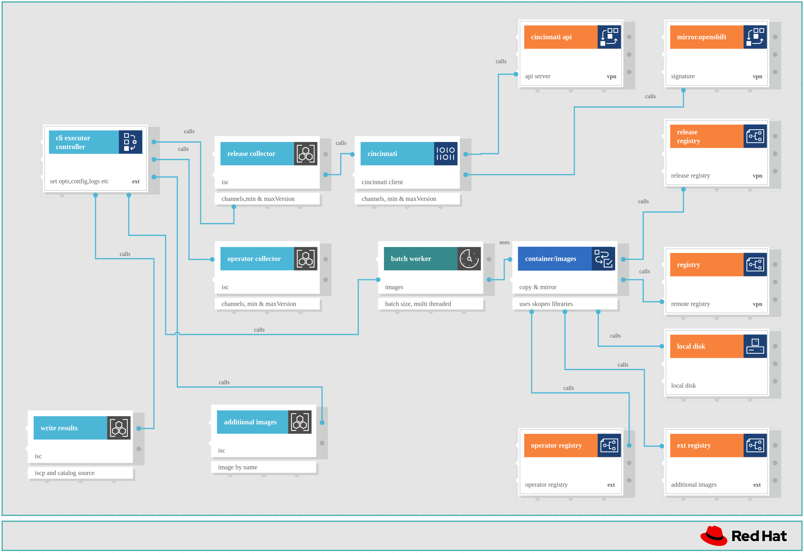

# oc-mirror v2

oc-mirror v2 is a command line tool to mirror Openshift Container Platform (OCP) Release, operator catalog and additional images.

The command line uses a declarative configuration file as the input to discover from where to get the container images and copy them to a container registry.

There are three workflows available in oc-mirror currently:

- `mirrorToDisk` (`m2d` for shorter) - pulls the container images from a source specified in the image set configuration and packs them into a tar archive on disk (local directory).
- `diskToMirror` (`d2m` for shorter) - copy the containers images from the tar archive to a container registry.
- `mirrorToMirror` (`m2m` for shorter) - copy the container images from the source specified in the image set configuration to the destination (container registry).

The workflows `m2d` and `d2m` are used together for fully disconnected scenarios, where `m2d` requires internet access to pull the images and `d2m` runs without internet access (Note: for enclave scenario `m2d` does not need internet access by changing registries.conf file).

The workflow `m2m` is used for partially disconnected scenario, the machine running the workflow has internet access and also access to the disconnected environment (target container registry).

When specifying the destination on the command line, there are two prefixes available:

- `file://<destination location>` - used in `m2d`: destination is a local directory where the tar archive will be stored.
- `docker://<destination location>` - used in `d2m` and `m2m`: destination is a container registry.

The default podman credentials location (`$XDG_RUNTIME_DIR/containers/auth.json`) is used for authenticating to the container registries. The docker location `~/.docker/config.json` for credentials is also supported as a secondary location.

**IMPORTANT**: The oc-mirror v1 was deprecated in OCP 4.18 (v1 README [here](v1/README_v1.md)) and will be removed in a future release.

## Table of contents
* [Getting Started](#getting-started)
    * [Prerequisites](#prerequisites)
    * [Clone the repository](#clone-the-repository)
    * [Building](#building)
* [Using the application](#using-the-application)
    * [oc-mirror command](#oc-mirror-command)
        * [Creating the Image Set Configuration](#creating-the-image-set-configuration)
        * [Mirror To Disk](#mirror-to-disk)
        * [Disk To Mirror](#disk-to-mirror)
        * [Mirror To Mirror](#mirror-to-mirror)
        * [Cluster Resources](#cluster-resources)
    * [Delete sub command](#delete-sub-command)
        * [Creating the Delete Image Set Configuration](#creating-the-delete-image-set-configuration)
        * [Delete Phase 1 (--generate)](#delete-phase-1)
        * [Delete Phase 2 ](#delete-phase-2)
    * [Other Features](#other-features)
* [Testing](#testing)
* [Development](#development)
  * [Architecture](#architecture)
  * [Code Source Documentation - Only for oc-mirror v2 developers](#code-source-documentation-only-for-oc-mirror-v2-developers)
* [Built with](#built-with)

## Getting Started
These instructions will provide a copy of the source code. After following these steps it will be possible to start using the command line tool.

### Prerequisites

```
- Git
- Golang
```

### Clone the repository

```
git clone https://github.com/openshift/oc-mirror.git
```

### Building
Building the `oc-mirror` binary is the first step and it is possible to build it with the following command from this (`oc-mirror/`) directory:

```
make clean
make tidy
make build
```

After performing the steps above a new file (`oc-mirror`) will appear in the `bin/` folder.

NOTE: it is possible to use oc-mirror as a plugin of Openshift Client (oc) by placing the oc-mirror binary in a directory specified in $PATH.

## Using the application
After building the binary in the previous step, it is possible to run the `oc-mirror` command and the `oc-mirror delete` sub command.

### oc-mirror command
The oc-mirror command copies container images specified in the Image Set Configuration from source to destination.

Three workflows are available with this command: `m2d`, `d2m` and `m2m`.

### Creating the Image Set Configuration
The Image Set Configuration is the input file for the oc-mirror command (using the flag `-c` or `--config`).

Here is an example of the Image Set Configuration for reference. More examples can be found [here](docs/image-set-examples/).

```
kind: ImageSetConfiguration
apiVersion: mirror.openshift.io/v2alpha1
mirror:
  platform:
    channels:
    - name: stable-4.18
      minVersion: 4.18.1
      maxVersion: 4.18.1
    graph: true
  operators:
    - catalog: registry.redhat.io/redhat/redhat-operator-index:v4.18
      packages:
       - name: aws-load-balancer-operator
       - name: 3scale-operator
       - name: node-observability-operator
  additionalImages:
   - name: quay.io/rh_ee_aguidi/multi-platform-container:latest
   - name: quay.io/rh_ee_aguidi/empty-image:latest
  helm:
    repositories:
      - name: cosigned
        url: https://sigstore.github.io/helm-charts
        charts:
          - name: cosigned
            version: 0.1.23
    local:
     - name: helm-empty-image
       path: /home/aguidi/go/src/github.com/aguidirh/oc-mirror/alex-tests/helm-empty-image
```

#### Mirror To Disk
```
./bin/oc-mirror -c ./isc.yaml file:///home/<user>/oc-mirror/mirror1 --v2
```
 
#### Disk To Mirror
```
./bin/oc-mirror -c ./isc.yaml --from file:///home/<user>/oc-mirror/mirror1 docker://localhost:6000 --v2
```
 
#### Mirror To Mirror
```
./bin/oc-mirror -c ./isc.yaml --workspace file:///home/<user>/oc-mirror/mirror1 docker://localhost:6000 --v2
```

`oc-mirror` has a set of flags to control its behavior.

```
      --authfile string                path of the authentication file. Default is ${XDG_RUNTIME_DIR}/containers/auth.json
      --cache-dir string               oc-mirror cache directory location. Default is $HOME
  -c, --config string                  Path to imageset configuration file
      --dest-tls-verify                require HTTPS and verify certificates when talking to the container registry or daemon (default true)
      --dry-run                        Print actions without mirroring images
      --from string                    Local storage directory for disk to mirror workflow
  -h, --help                           help for oc-mirror
      --image-timeout duration         Timeout for mirroring an image (default 10m0s)
      --log-level string               Log level one of (info, debug, trace, error) (default "info")
      --max-nested-paths int           Number of nested paths, for destination registries that limit nested paths
      --parallel-images uint           Indicates the number of images mirrored in parallel (default 8)
      --parallel-layers uint           Indicates the number of image layers mirrored in parallel (default 10)
      --policy string                  Path to a trust policy file
  -p, --port uint16                    HTTP port used by oc-mirror's local storage instance (default 55000)
      --registries.d DIR               use registry configuration files in DIR (e.g. for container signature storage)
      --remove-signatures              Do not copy image signature (default true)
      --retry-delay duration           delay between 2 retries (default 1s)
      --retry-times int                the number of times to possibly retry (default 2)
      --rootless-storage-path string   Override the default container rootless storage path (usually in etc/containers/storage.conf)
      --secure-policy                  If set, will enable signature verification (secure policy for signature verification)
      --since string                   Include all new content since specified date (format yyyy-MM-dd). When not provided, new content since previous mirroring is mirrored
      --src-tls-verify                 require HTTPS and verify certificates when talking to the container registry or daemon (default true)
      --strict-archive                 If set, generates archives that are strictly less than archiveSize (set in the imageSetConfig). Mirroring will exit in error if a file being archived exceed archiveSize(GB)
  -v, --version                        version for oc-mirror
      --workspace string               oc-mirror workspace where resources and internal artifacts are generated
```

#### Cluster Resources
In the end of a successful `d2m` or `m2m` workflow, cluster resources will be generated under `/home/<user>/oc-mirror/mirror1/working-dir/cluster-resources`. It is needed to apply these cluster resources on the openshift cluster so the cluster can pull the container images from the right container registry. The cluster resources generated by oc-mirror are:

* ImageDigestMirrorSet (IDMS)
* ImageTagMirrorSet (ITMS)
* CatalogSource
* ClusterCatalog
* UpdateService (Used by OpenShift Update Service - OSUS)

### Delete sub command

There is also a `delete` sub command to delete images specified in the Delete Image Set Configuration from a remote registry. This command is split in two phases:

- Phase 1: using a delete image set configuration as an input, oc-mirror discovers all images that needed to be deleted. These images are included in a delete-images file to be consumed as input in the second phase.
- Phase 2: using the file generated in first phase, oc-mirror will delete all container image manifests specified on this file on the destination specified in the command line. It is up to the container registry to run the garbage collector to clean up all the blobs which are not referenced by a manifest. Deleting only manifests is safer since blobs shared between more than one image are not going to be deleted.

For more details about the delete feature can be found [here](docs/features/delete-functionality.md).

### Creating the Delete Image Set Configuration

```
kind: DeleteImageSetConfiguration
apiVersion: mirror.openshift.io/v2alpha1
delete:
  platform:
    channels:
    - name: stable-4.18
      minVersion: 4.18.1
      maxVersion: 4.18.1
    graph: true
  operators:
    - catalog: registry.redhat.io/redhat/redhat-operator-index:v4.18
      packages:
       - name: aws-load-balancer-operator
       - name: 3scale-operator
       - name: node-observability-operator
  additionalImages:
   - name: quay.io/rh_ee_aguidi/multi-platform-container:latest
   - name: quay.io/rh_ee_aguidi/empty-image:latest
  helm:
    repositories:
      - name: cosigned
        url: https://sigstore.github.io/helm-charts
        charts:
          - name: cosigned
            version: 0.1.23
    local:
     - name: helm-empty-image
       path: /home/aguidi/go/src/github.com/aguidirh/oc-mirror/alex-tests/helm-empty-image
```


#### Delete Phase 1
```
./bin/oc-mirror delete -c ./delete-isc.yaml --generate --workspace file:///home/<user>/oc-mirror/delete1 --delete-id delete1-test docker://localhost:6000 --v2
```

#### Delete Phase 2
```
./bin/oc-mirror delete --delete-yaml-file /home/<user>/oc-mirror/delete1/working-dir/delete/delete-images-delete1-test.yaml docker://localhost:6000 --v2
```

The `delete` sub-command has its own set of flags:

```
      --delete-id string          Used to differentiate between versions for files created by the delete functionality
      --delete-signatures         Used to delete the container image signatures, for multi arch images, it deletes only the manifest list signature
      --delete-v1-images          Used during the migration, along with --generate, in order to target images previously mirrored with oc-mirror v1
      --delete-yaml-file string   If set will use the generated or updated yaml file to delete contents
      --force-cache-delete        Used to force delete  the local cache manifests and blobs
      --generate                  Used to generate the delete yaml for the list of manifests and blobs , used in the step to actually delete from local cache and remote registry
  -h, --help                      help for delete
```

### Other Features
* [Enclave support](v2/docs/features/enclave_support.md)

## Testing
It is possible to run in this module unit tests.

To run the unit tests run the following command from this directory:

```
make test-unit
```

It is also possible to see all the lines coverage by the unit tests generating an HTML using the following command (it will create a file called `cover.html` in the `v2/tests/results` folder):

```
make v2cover
```

## Development
This section will give an overview about oc-mirror v2 architecture and how to generate docs from oc-mirror source code.

### Architecture


### Code Source Documentation Only for oc-mirror v2 developers

The module contains the documentation generated from the code. It means that all comments in packages, types, funcs, variables and constants will generate documentation in HTML.

**Install the godoc**
```
go install golang.org/x/tools/cmd/godoc
```

**Run the command below **
```
godoc -http=:6060
```

**View docs**

Open godocs [here](http://localhost:6060/pkg/github.com/openshift/oc-mirror/?m=all) while the command above is still running.


## Built with
* [Golang](https://go.dev) - Programming Language
