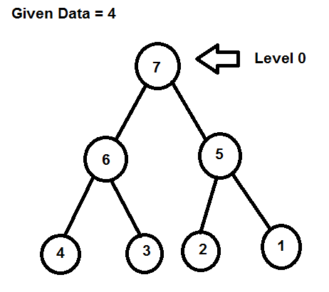

# OCPSTRATS-1515 - Reflecting the mirrored operators only in catalogs mirrored by oc-mirror

**This document is a work in progress and will be updated along with the decisions and implementations that will come in the future.**

## Table of contents
- [OCPSTRATS-1515 - Reflecting the mirrored operators only in catalogs mirrored by oc-mirror](#ocpstrats-1515---reflecting-the-mirrored-operators-only-in-catalogs-mirrored-by-oc-mirror)
  - [Table of contents](#table-of-contents)
  - [Background](#background)
  - [Feature request](#feature-request)
  - [Implementation - rebuilding catalogs](#implementation---rebuilding-catalogs)
    - [Description](#description)
    - [TLDR; complexity + uncertainty level estimation](#tldr-complexity--uncertainty-level-estimation)
    - [Generating the FBC](#generating-the-fbc)
      - [Solution 1: Relying on existing POC(preferred)](#solution-1-relying-on-existing-pocpreferred)
        - [Pros](#pros)
        - [Cons](#cons)
        - [Complexity](#complexity)
      - [Solution 2: Adapting existing filtering](#solution-2-adapting-existing-filtering)
        - [Pros](#pros-1)
        - [Cons](#cons-1)
        - [Complexity](#complexity-1)
    - [Preparing catalog files](#preparing-catalog-files)
      - [Complexity](#complexity-2)
    - [Building the container image](#building-the-container-image)
      - [Requirements:](#requirements)
      - [Implementation](#implementation)
  - [Complexity level estimation](#complexity-level-estimation)
  - [Risks](#risks)
  - [Alternatives](#alternatives)
    - [Pros:](#pros-2)
    - [Cons:](#cons-2)
  - [Conclusion](#conclusion)

## Background

In oc-mirror v2 (and in v1 after bug fix [OCPBUGS-31536](https://issues.redhat.com/browse/OCPBUGS-31536)), oc-mirror doesn't rebuild catalogs.

* The filtered declarative config isn't recreated based on the imagesetconfig filter
* The catalog cache isn't regenerated
* The catalog image isn't rebuilt based on the above 2 elements
* Instead, the original catalog image is pushed as is to the mirror registry. Its declarative config will show all operators, and for each operator all channels and all bundles.
* This behavior is causing some inconvenience to our users, especially [OCPBUGS-35386](https://issues.redhat.com/browse/OCPBUGS-35386)

## Feature request

oc-mirror customers would like the mirrored catalog to reflect the reality of the operators that are really available in the mirrored registy.

This way, on air-gapped clusters, OPS engineers cannot by mistake attempt to upgrade an operator to an operator version that is listed in the catalog but isn't available in the mirror registry.

## Implementation - rebuilding catalogs

### Description

Rebuilding catalogs was oc-mirror v1's answer to the problem stated in OCPSTRATS-1515. 

Building a filtered catalog entails the following tasks:
1. **Generate a catalog FBC (File based Catalog)**, that contains the filtered operators, and their respective packages, channels and bundles. 
2. **Prepare the binaries and files for the filtered catalog**, which include the opm binary and eventually catalog cache that is compatible with FBC AND the opm version chosen
3. **Building the container image**, based on the above.

In the following sections, we will attempt to analyze each task, describe the possible solutions and give an estimation of the level of complexity for the task. 

### TLDR; complexity + uncertainty level estimation

| Task | Complexity | Uncertainty |
|---|---|---|
| Generate catalog FBC | medium | :red_circle::red_circle::red_circle::red_circle::white_circle:|
| Prepare catalog files | medium |:red_circle::red_circle::red_circle::white_circle::white_circle:|
| Build catalog image | medium | :red_circle::red_circle::red_circle::red_circle::white_circle:|

### Generating the FBC

#### Solution 1: Relying on existing [POC](https://github.com/operator-framework/operator-registry/pull/1231)(preferred)

This POC proposes a new `CatalogFilter` interface that can be used when calling `opm render` in `operator-registry`. The command accepts a filtering configuration file as input, which can be used in order to generate a FBC file containing filtered packages, channels (with valid upgrade graphs) and bundles. 

The implementation within the [PR](https://github.com/operator-framework/operator-registry/pull/1231) has the following specificities:
* Allows to start from an image reference as the source FBC, or an on-disk FBC : which is a very positive point as it allows it to be easily pluggable to oc-mirror
* Produces filtered and valid FBCs, making sure channels have a single head.
* Weird, but it doesn't take skipRange into account at all => Question for Joe
* The filtering configuration file uses the semVer notation to formulate a minVersion maxVersion
* In its current format, this POC covers 2/19 oc-mirror filtering use cases. This is because: 
  * When no filtering is set, renders all versions within the selected channel - This is not what oc-mirror expects: we'd need the head of the channel only
  * when filtering config is empty, renders zero operators - in this case, oc-mirror expects to have the head of each operator
  * when filtering by operator name only, renders all bundles, all channels - in this case, oc-mirror expects the channel head alone.  
  * `full` is used in oc-mirror in order to specify that all the channel contents (not only head) needs to be rendered. This is not part of the POC PR
  * Filtering directly on minVersion and maxVersion (without specifying a channel) is recognized as valid filtering in oc-mirror. This is not part of the POC PR
  * Filtering by `SelectedBundles` is recognized as valid filtering in oc-mirror. This is not part of the POC PR

##### Pros
* Done by OLM, this POC closest probably to what the OLM on cluster would expect from an operator's upgrade path. 
* It's a step towards the introspection tool
* A filtering that relies on the FBC API (`replace`, `skip` and NOT `skipRange`) , instead of the current oc-mirror v2 implementation which simply relies on semver, and was originally designed as a temporary filtering.

##### Cons
* The POC implementation is not inline with what oc-mirror expects. A new implementation is necessary
* The current v2 filtering would need to be re-written in order to rely on this catalogFilter 

##### Complexity

In operator-registry [fork](https://github.com/sherine-k/operator-registry/tree/filter-fbc) and the following [demo](https://github.com/sherine-k/catalog-filter), we can show that starting from the PR, it was easy to create a new `CatalogFilter` implementation that respects oc-mirror's requirements for filtering. 

** This implementation passes 11/19 filtering use cases **. This implementation effort was timeboxed to 2days.

On these grounds, **complexity is estimated to medium**, with the following identified subtasks
* :white_check_mark: case of no filter at all should return heads of all operators
* :white_check_mark: case of filtering by operator name should return heads of those operators
* :white_check_mark: when `full` is used all channel contents are returned
* :white_square_button: case of filtering by min and/or max without any specified channels
* :white_square_button: case of filtering by selectedBundles
* :white_square_button: Creating an independant repository: [PR#1231](https://github.com/operator-framework/operator-registry/pull/1231) won't merge into opm. Filtering needs to be a separate tool. This is because, long term, the opm binary will only be useful for v0 operations.

#### Solution 2: Adapting existing filtering

During the work on oc-mirror v2, a simple and temporary filtering implementation based on the bundle version. This filtering helps select the images that need to be mirrored, but is not used to produce a new FBC. 

One possible solution is to improve this filtering in order to render an FBC as well as (as currently) a list of related images within filter. 

This work shouldn't be underestimated: A valid FBC from the point of view of OLM needs to have:
* A default channel that is included in the FBC
* No dangling versions, ie no versions that cannot reach the channel head
* A single channel head

**The risk here remains that filtering by semver is not the same as relying on the FBC API (`skip`, `replace` and `skipRange`)** and can produce catalogs that are unuseable by OLM. To illustrate the complexity of such a task, let's consider the following channel, and an imageSetConfig that instructs oc-mirror to take `maxVersion: 6` as filtering for this channel.

Following the semver filtering, bundles 1,2,3,4,5,6 are considered within the filter. 
But a channel containing these 6 bundles is not a valid channel from the point of view of OLM as it contains 2 heads: 5 and 6.

:warning: Mitigation : This type of scenario doesn’t seem to exist in redhat catalogs. Probably in community catalogs or certified catalogs.

##### Pros

* A solution that can be proper to oc-mirror

##### Cons

* May lead to invalid catalogs

##### Complexity

**complexity is estimated to large** as the implementation needs to be modified :
* to produce FBC along with a list of images
* the produced FBC should be valid, and not contain multiple heads, which requires implementing a complex logic

### Preparing catalog files

A catalog image is:
* based (FROM statement) on an opm image
* contains the FBC catalog, under the /configs folder
* contains the cache folder corresponding to the FBC catalog
* proper labels and CMD are needed in order to link everything together properly

To the best of our knowledge, the best strategy for rebuilding the catalog image is to disregard the incoming catalog image (and the opm binary it contains): we don't know if the image is binary-less ([OPRUN-3346](https://issues.redhat.com/browse/OPRUN-3346)) or cache-less([OPRUN-3347](https://issues.redhat.com/browse/OPRUN-3347)), both or none...

Instead, `operator-registry` (opm) provides a `opm generate dockerfile` which could be used to prepare a Dockerfile. This Dockerfile once built, would provide an image that includes an opm binary, the FBC and corresponding cache.

Which tag should we use with ` --binary-image`? 
* Should this tag depend on the `operator-registry` module version used in oc-mirror's go.mod?
* Or should this tag depend on the release? Ie. For oc-mirror v4.17, we should be using quay.io/operator-framework/opm:4.17?
* Or should this tag depend on the catalog tag (not always reliable)? ie. for redhat-operator-index:v4.14, we should be using quay.io/operator-framework/opm:4.14?

#### Complexity

Once the uncertainty about the implementation details taken away, this task should be a **small sized complexity task**.

### Building the container image

From the Dockerfile obtained in the previous task, we need to build the container image. 

#### Requirements: 
* should be able to build images for catalogs that are registry based or file based . This should not be a problem: as stated in the previous section, we should not build the filtered catalog using FROM the catalog referenced in the imageSetConfig
* should build multi-arch images
* should be able to build images in enclave environment. ie. respect auth, tls, registries.conf and proxy as stated in flags and env vars

#### Implementation

Several Go modules provide a way to build containers in go:

| Solution | Description |
|---|---|
| Shell-out to podman | Creates an external dependency on podman.  Command can be different according to platform and OS. Cannot build when on disk oci catalogs are used.  [POC](https://github.com/openshift/oc-mirror/commit/2db93ca48cd40daf06257650555b7f1cfd301417)|
| Buildah | Relies on `containers/image` suite.  Makes oc-mirror harder to debug.  Cannot build when on disk oci catalogs are used.  [POC](https://github.com/openshift/oc-mirror/commit/88472f2543d999c0e63bad161e65f91f77e512ab)
| ORAS |No POC|
| go-containerregistry| No POC.   Not compatible with registries.conf|

## Complexity level estimation

Without POCs on the other modules, it is hard to estimate exactly the complexity of this issue.

## Risks

The main risk of rebuilding the catalog is that the signature, SBOM and other attestations will not match the new rebuilt catalog. 
This may lead to customers mistaking filtered catalogs with untrusted catalogs. 

## Alternatives

An alternative that we previously discussed with the OLM team without reaching concensus is to not rebuild the catalogs, and include filtered bundles (or filtering instructions) as a configmap that can be referenced with the catalogsource. 

### Pros:
Signature and SBOM are not impacted
### Cons:
Users of `oc-mirror list` will not benefit from the metadata included in the configmap. Therefore, they cannot rely on `oc-mirror list mirror.acme.com/mirrored-catalog:latest` in order to get the list of operator bundles that are available on the mirror registry for `mirrored-catalog`. 

## Conclusion

We are closing CLID-226 at this time while we wait for further instructions from Program Management. This document shall be updated based on future decisions.