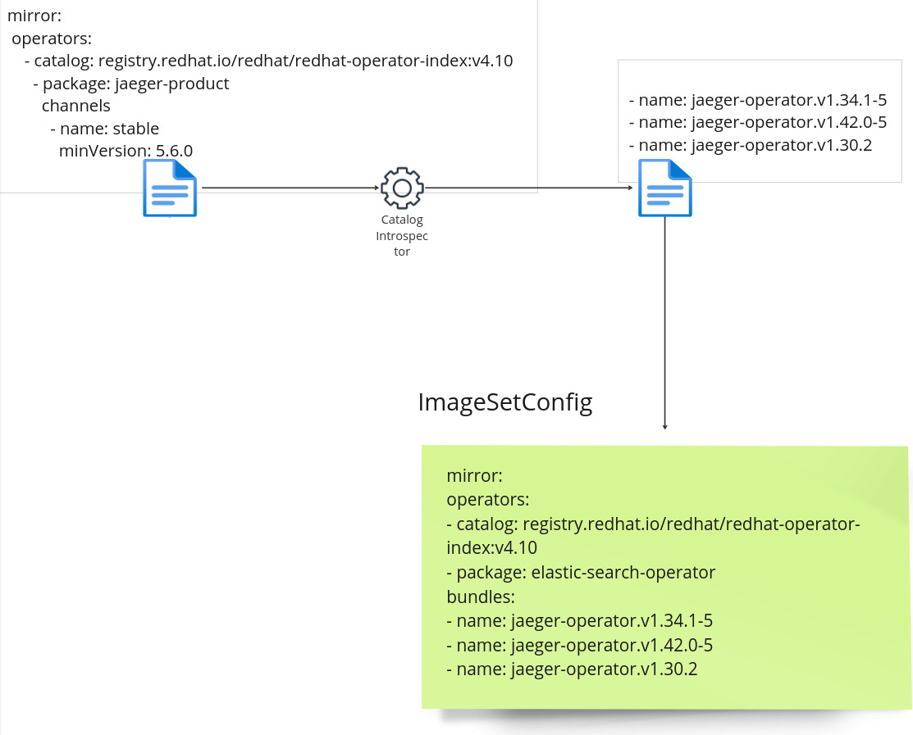

# Catalog filtering in V2

## State of filtering in V1

In V1, filtering of the operators catalog based on the configuration in ImageSetConfig is as follows:
* is based ONLY on `replaces` fields set on bundles in the channel
* ignores `skipRange` and `skips` set on those bundles
* When no channel filtering is applied, default channel is assumed
* When channel filtering is applied, default channel needs to stay part of the filtered channel (even if the client doesn't need it), so that the resulting declarative config (FBC of the catalog) is still considered valid
* When several channels are specified in the filtering, and a maxVersion is specified for a channel, but that version is not the head of that channel, the head is still included (ignoring user instructions) in an attempt to facilitate cross channel upgrades.
* constructs a filtered FBC based on the filtered content
* compares that filtered FBC to the filtered FBC from the previous mirroring: in order to take into account only the delta images.
* tries to determine GVK or bundle dependencies,  in order to mirror those dependencies as well

This implementation is not ideal for users, because :
* the mirrored bundles don't always allow a smooth upgrade of operators
* some mirrored bundles are sometimes missing for certain imageSetConfig use-cases
* some mirrored bundles are mirrored although not part of the upgrade graph expected by OLM : Volume of mirrored content unnecessarily high

## Solutions studied for filtering in V2

This lead the oc-mirror team to implement a different approach to filtering operator catalogs for the V2.

When selecting bundles for mirroring, oc-mirorr V2 will not verify if the bundles were previously mirrored. The list of bundles selected will be solely based on processing the FBC declarative config of the catalog with the filtering from the imageSetConfig. The exclusion of some bundles from the final mirroring will be differed to another component of oc-mirror, which will handle incremental mirroring (archive diff). 

When selecting bundles for mirroring, oc-mirror V2 will not attempt to bridge the graph between 2 channels, or between one catalog and the other. It will strictly respect the client's instructions given by the imageSetConfig.

When selecting bundles for mirroring, oc-mirror V2 will not attempt to figure out GVK or bundle dependencies, and will not add them to the mirroring set. It is respecting strictly the client's instructions. So the client will need to explicitly add dependant packages and their versions if needed.

Regarding the way to determine the list of bundles included in the filtering, several solutions were studied, described below.

For a complete list of use cases that are accounted for, please see [below](#annex---acceptance-criteria-set-for-v2).

:warning: In this document, we do not discuss if/how the catalog would be rebuilt with the filtered content. For more about rebuilding catalogs in oc-mirror v2, please refer to [catalog rebuild](./OCPSTRAT-1515.md)

### Solutions implemented

TLDR; 
* Up to OCP 4.17 : From the following studied solutions, S1 and S4(partially by supporting filtering through selection of bundles) are implemented for oc-mirror V2.
* Starting OCP 4.18: S1 and S4 are used by default. S4b is implemented behind feature flag `--alpha-ctlg-filter`: it uses an external catalog filtering library developped through joint efforts between the OLM and oc-mirror teams. 

The user can filter operators and bundles by operator names, channels, minVersion/maxVersion as in V1.

### S1 - SemVer (Main solution for oc-mirror <=4.17)

Most bundle versions are semver compatible. The bundles included in a channel can simply be sorted by version and any bundles that fall in the range selected in the ImageSetConfig are taken. 

Such an algorithm will result in idempotent results compared to V1 results. Nevertheless, the upgrade graph information conveyed by the `replaces`, `skip` and `skipRange` is not taken into account. 
This algorithm is totally different from the one used by OLM. There is no guarantee here that the selected list of bundles would allow OLM to perform an upgrade for the selected operator. There may also be a much shorter path between the minVersion and the maxVersion requested. oc-mirror will, in this case, mirror more bundles than what a cluster would need to perform the upgrade. 

### S2 - Call `render-graph`

The `opm` binary, or [operator-registry](https://github.com/operator-framework/operator-registry) has a `render-graph` subcommand under its `alpha`.

This subcommand can produce [mermaid](https://github.com/mermaid-js/mermaid) graphs that show all upgrade paths in all channels found.

It is possible to call the `render-graph` API directly from oc-mirror V2, and process the mermaid formatted text in order to determine the upgrade path respecting the ImageSetConfig.

Example of command:
```bash
$ opm alpha render-graph registry.redhat.io/redhat/redhat-operator-index:v4.14 -p jaeger-product
graph LR
  %% package "jaeger-product"
  subgraph "jaeger-product"
    %% channel "stable"
    subgraph jaeger-product-stable["stable"]
      jaeger-product-stable-jaeger-operator.v1.30.2["jaeger-operator.v1.30.2"]
      jaeger-product-stable-jaeger-operator.v1.34.1-5["jaeger-operator.v1.34.1-5"]
      jaeger-product-stable-jaeger-operator.v1.30.2["jaeger-operator.v1.30.2"]-- replace --> jaeger-product-stable-jaeger-operator.v1.34.1-5["jaeger-operator.v1.34.1-5"]
      jaeger-product-stable-jaeger-operator.v1.30.2["jaeger-operator.v1.30.2"]-- "skipRange(>=1.13.0 <1.34.1-5)" --> jaeger-product-stable-jaeger-operator.v1.34.1-5["jaeger-operator.v1.34.1-5"]
      jaeger-product-stable-jaeger-operator.v1.42.0-5["jaeger-operator.v1.42.0-5"]
      jaeger-product-stable-jaeger-operator.v1.30.2["jaeger-operator.v1.30.2"]-- "skipRange(>=1.13.0 <1.42.0-5)" --> jaeger-product-stable-jaeger-operator.v1.42.0-5["jaeger-operator.v1.42.0-5"]
      jaeger-product-stable-jaeger-operator.v1.34.1-5["jaeger-operator.v1.34.1-5"]-- "skipRange(>=1.13.0 <1.42.0-5)" --> jaeger-product-stable-jaeger-operator.v1.42.0-5["jaeger-operator.v1.42.0-5"]
    end
  end
```

Calling `render-graph`, even programmatically, requires `operator-registry` to pull the catalog, even if oc-mirror has already got it in its cache. This operation takes a few minutes, and can result in bad performance when several catalogs are included in the imageSetConfig.

Furthermore, `render-graph` looks at all the channels included in the catalog for the requested package. At the moment, there is no way to restrict its field of rendering to a certain channel.

`render-graph` provides a way to start the graph from a minimum version, with the command line argument `--minimum-edge`. There is no way to provide an upper limit. 

Extra processing on oc-mirror side will be needed in order to determine the list of bundles to include based on the channels selected and the maxVersion. 

Most of the information included in the `render-graph` output can be easily found in the FBC declarative config, which oc-mirror would have kept in its cache. 

The question here is to determine if processing mermaid format is lighter than processing FBC (discussed in the next paragraph) in order to generate the list of filtered bundles.

### S3 - Implement processing of `skip`, `skipRange` and `replaces` inside oc-mirror v2

This solution is based on processing the FBC declarative config included within the catalog, and looking at all 3 information `skip`, `skipRange` and `replaces` in order to determine if a bundle should be included in the list of filtered bundles. 

Compared to the previous solution, the catalog would not be pulled again. Nevertheless, this algorithm being different from the one used by `operator-registry` or OLM, it is again another best effort attempt to determine the upgrade graph with no guarantees that the upgrade path would be considered valid by OLM on a cluster. 

Compared to the first solution (Semver), implementing the algorithm here is definitely more complex. 

### S4 - Create API v2 for filtering

As discussions are ongoing for [RFE-4930](https://issues.redhat.com/browse/RFE-4930) which would allow to determine a list of images to mirror based on filtering configuration similar to the imageSetConfiguration. 

It is too early in the process to count on such an external tool for the 4.16 timeframe. 

Nevertheless, it might be something to consider in the future.

If an introspection tool is able, and can provide at least the list of bundle versions that fit the input filtering conditions, oc-mirror could evolve its ImageSetConfig API in order to allow the user to set a list of bundle versions instead of channels and version ranges. 

.

In this solution, as illustrated in the above diagram, the introspection tool would :
* Take an input in yaml format, with a schema close to the ImageSetConfig filtering (yaml at the top left side of the diagram)
* And output a list of bundles that fit the filter (yaml list on the top right side of the diagram)
* The user would copy the list to the ImageSetConfig of oc-mirror
* oc-mirror simply mirrors the list of bundles set in its ImageSetConfig

This solution guarantees that the bundles selected are inline with what OLM would expect on an actual cluster. The mirrored bundles are sure to allow an update of the operator. 

This solution is still under discussion though. There is little chance it would be productized in time for oc-mirror to use it for 4.16. 

A solution where oc-mirror can call the introspection API directly, without change to the ImageSetConfig API, and without needing the user's intervention can be designed. 

It can be looked at as the longer term definitive solution.

In 4.16, the API change to ImageSetConfig is implemented, allowing the user to list directly the bundles which are needed to be mirrored. ([example](../../examples/imageset-config-filter-catalog-by-bundle.yaml))

### S4b - Initial API v2 for filtering

Based on further discussions, it was evident that oc-mirror v2 needs to implement rebuilding of catalogs, as defined in [OCPSTRAT-1515](https://issues.redhat.com/browse/OCPSTRAT-1515).

A simple list of bundle versions and/or a list of images to mirror (as described in S4 and [RFE-4930](https://issues.redhat.com/browse/RFE-4930)) is not enough to rebuild catalogs. 

S4b is based on a filtering API for catalogs that is able to take the following inputs, and provide a filtered, valid declarative config as an output:
* a declarative config
* a filtering configuration such as [this](https://github.com/sherine-k/catalog-filter/blob/main/pkg/filter/mirror-config/v1alpha1/testdata/configs/valid.yaml)

The output declarative config should be valid with rights to OLM: channels without multiple channel heads, channels without cycles.

Based on joint efforts of the OLM and oc-mirror teams, this [API](https://github.com/sherine-k/catalog-filter/tree/main) has been implemented.

oc-mirror v2 will rely on this new API. It will adapt its imageSetConfig stanza to create a `olm.operatorframework.io/filter/mirror/v1alpha` filter, that can be passed as the API input, and collect a filtered FBC. All bundles included in that filtered FBC are considered candidates for mirroring. 

## Conclusion - rationale


| Solution | Pros | Cons |
|---|---|---|
|S1 - SemVer (SELECTED SOLUTION)|* Simple to implement<br>* Works for most cases| * No guarantees for upgrades on the cluster<br>* Mirrored volume possibly greater<br>* Doesn't allow for catalog rebuild |
|S2 - Use `render-graph`|* Partially delegates graph generation to OPM| * Low performance due to multiple pulls of the >1G catalogs<br>* Still requires processing of mermaid format graph<br>* No guarantees for upgrades on the cluster side
|S3 - Use `skip`, `skipRange`, `replace`|* Is closer in terms of algorithm to what OLM does on a cluster|* Remains a best effort to approach the OLM algorithm, with no guarantees<br>* complexity|
|S4 - API v2 |* Inline with OLM expectations<br>* Idempotent<br>* Fastest path for upgrades (smaller mirroring volume)|* Not ready for the 4.16 timeline<br>* API break for ImageSetConfig<br>* Doesn't allow for catalog rebuild |
|**S4b - FBC filtering API** |* **Inline with OLM expectations**<br>* **Idempotent**<br>* **Fastest path for upgrades (smaller mirroring volume)**<br>* **Allow for catalog rebuild**| * **Complex and risky logic**|

**From what we see in the table above, there is no perfect fit.
The team proposes to use S4b - FBC filtering API as of 4.18** 

## Annex - Acceptance criteria set for V2

Below is a list of scenarios, and the expected outcomes. 

| ImageSetConfig filtering | Expected bundle versions |
|--------------------------|--------------------------|
|<pre>mirror:<br>  operators:<br>    - catalog: registry.redhat.io/redhat/redhat-operator-index:v4.10</pre> | For each package in the catalog, 1 bundle, corresponding to the head version for each channel of that package |
|<pre>mirror:<br>  operators:<br>    - catalog: registry.redhat.io/redhat/redhat-operator-index:v4.10<br>      full: true|all bundles of all channels of the specified catalog|
|<pre>mirror:<br>  operators:<br>    - catalog: registry.redhat.io/redhat/redhat-operator-index:v4.10<br>      - package: elastic-search-operator</pre>|1 bundle, corresponding to the head version for each channel of that package|
|<pre>mirror:<br>  operators:<br>    - catalog: registry.redhat.io/redhat/redhat-operator-index:v4.10<br>      full: true<br>      - packages:<br>          - name: elasticserach-operator|all bundles of all channels for the packages specified|
|<pre>mirror:<br>  operators:<br>    - catalog: registry.redhat.io/redhat/redhat-operator-index:v4.10<br>      - package: elastic-search-operator<br>        minVersion: 5.6.0</pre>| all bundles in all channels of that package, from minVersion, up to each channel's head  |
|<pre>mirror:<br>  operators:<br>    - catalog: registry.redhat.io/redhat/redhat-operator-index:v4.10<br>      - package: elastic-search-operator<br>        maxVersion: 6.0.0</pre>| all bundles in all channels of that package, that are lower than maxVersion |
|<pre>mirror:<br>  operators:<br>    - catalog: registry.redhat.io/redhat/redhat-operator-index:v4.10<br>      - package: elastic-search-operator<br>        minVersion: 5.6.0<br>        maxVersion: 6.0.0</pre>|all bundles in all channels, between minVersion and maxVersion for that package. Head of channel is not included, even if multiple channels are included in the filtering| 
|<pre>mirror:<br>  operators:<br>    - catalog: registry.redhat.io/redhat/redhat-operator-index:v4.10<br>      - package: elastic-search-operator<br>        defaultChannel: stable<br>        channels:<br>          - name: stable</pre>|head bundle for the selected channel of that package.<br>`defaultChannel` should be used in case the filtered channel(s) is(are) not the default|
|<pre>mirror:<br>  operators:<br>    - catalog: registry.redhat.io/redhat/redhat-operator-index:v4.10<br>      full: true<br>      - packages:<br>          - name: elasticserach-operator<br>            channels:<br>               - name: 'stable-v0'|all bundles for the packages and channels specified.<br>`defaultChannel` should be used in case the filtered channel(s) is(are) not the default|
|<pre>mirror:<br>  operators:<br>    - catalog: registry.redhat.io/redhat/redhat-operator-index:v4.10<br>      - package: elastic-search-operator<br>        channels<br>          - name: stable<br>          - name: stable-5.5</pre>|head bundle for the each selected channel of that package|
|<pre>mirror:<br>  operators:<br>    - catalog: registry.redhat.io/redhat/redhat-operator-index:v4.10<br>      - package: elastic-search-operator<br>        channels<br>          - name: stable<br>            minVersion: 5.6.0</pre>|within the selected channel of that package, all versions starting minVersion up to channel head.<br>`defaultChannel` should be used in case the filtered channel(s) is(are) not the default. |
|<pre>mirror:<br>  operators:<br>    - catalog: registry.redhat.io/redhat/redhat-operator-index:v4.10<br>      - package: elastic-search-operator<br>        channels<br>          - name: stable<br>            maxVersion: 6.0.0</pre>|within the selected channel of that package, all versions up to maxVersion:<br> Head of channel is not included, even if multiple channels are included in the filtering.<br>User should expect errors if this filtering leads to a channel with multiple heads.|
|<pre>mirror:<br>  operators:<br>    - catalog: registry.redhat.io/redhat/redhat-operator-index:v4.10<br>      - package: elastic-search-operator<br>        channels<br>          - name: stable<br>            minVersion: 5.6.0<br>            maxVersion: 6.0.0</pre>|within the selected channel of that package, all versions between minVersion and maxVersion. <br> Head of channel is not included, even if multiple channels are included in the filtering.<br>User should expect errors if this filtering leads to a channel with multiple heads.|
|<pre>mirror:<br>  operators:<br>    - catalog: registry.redhat.io/redhat/redhat-operator-index:v4.10<br>      - package: elastic-search-operator<br>        channels<br>          - name: stable<br>        minVersion: 5.6.0<br>        maxVersion: 6.0.0</pre>|Error: filtering by channel and by package min/max should not be allowed|
|<pre>mirror:<br>  operators:<br>    - catalog: registry.redhat.io/redhat/redhat-operator-index:v4.10<br>      full: true<br>      - package: elastic-search-operator<br>        channels<br>          - name: stable<br>        minVersion: 5.6.0<br>        maxVersion: 6.0.0</pre>|Error: filtering using full:true and min or max version is not allowed
|<pre>mirror:<br>  operators:<br>    - catalog: registry.redhat.io/redhat/redhat-operator-index:v4.10<br>      full: true<br>      - package: elastic-search-operator<br>        channels<br>          - name: stable<br>            minVersion: 5.6.0<br>            maxVersion: 6.0.0</pre>|Error: filtering using full:true and min or max version is not allowed